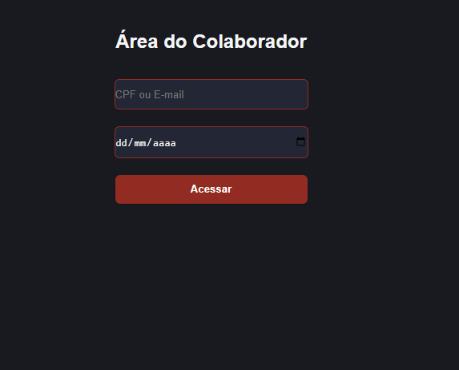
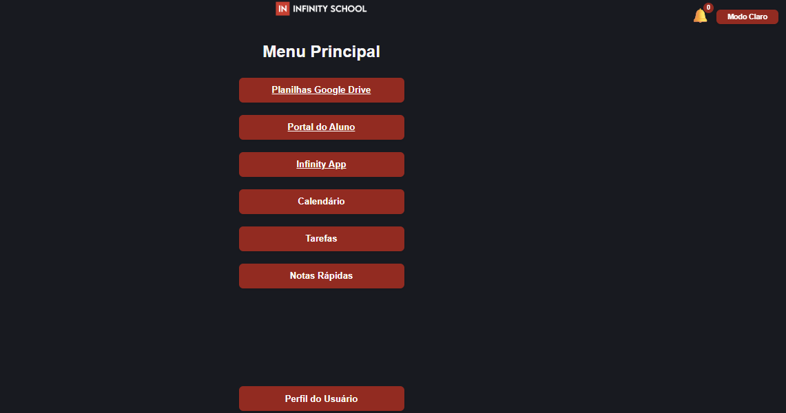
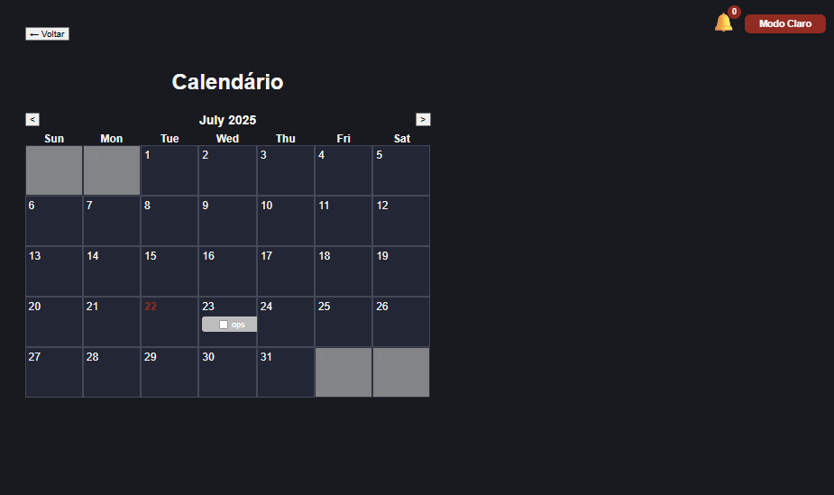
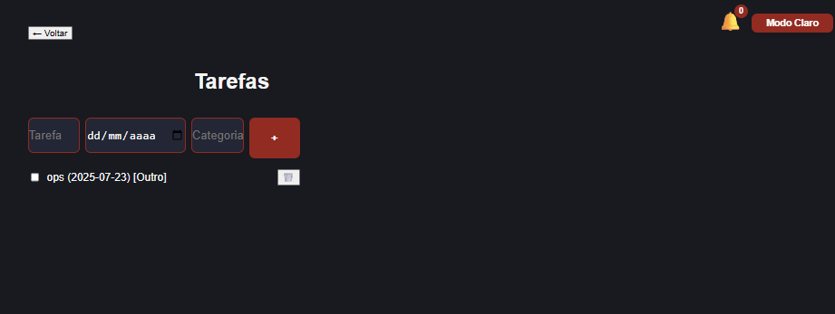
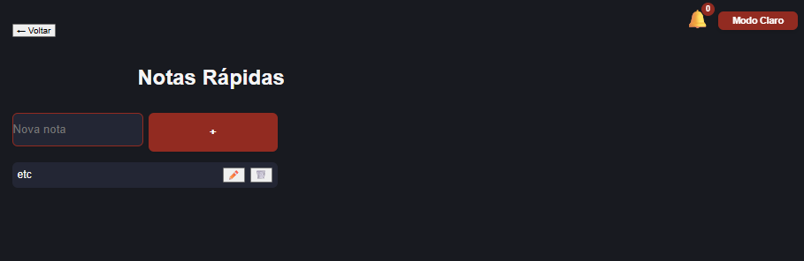
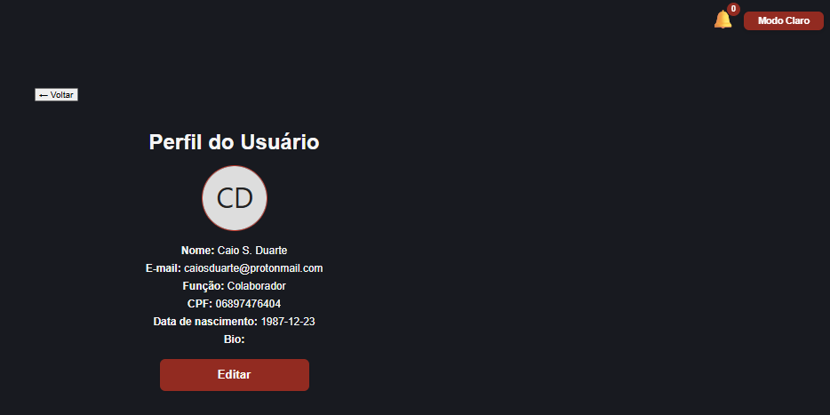

# Infinity School - Área do Colaborador

## 🚀 Tecnologias Usadas
- **React.js:** Framework principal do frontend.
- **Vite:** Ferramenta moderna de build e servidor de desenvolvimento para projetos web. Vite é muito mais rápido que o tradicional Create React App, pois faz o carregamento instantâneo dos arquivos e recarrega o app quase em tempo real durante o desenvolvimento.
- **HTML5 & CSS3**
- **JavaScript (ES6+)**
- **Python + Flask:** Backend para API REST.
- **SQLite:** Banco de dados local para persistência.
- **date-fns:** Manipulação de datas no calendário.

---

## 📄 Descrição do Projeto
Aplicativo web para organização e produtividade dos funcionários da Infinity School. Permite acesso rápido a links úteis, gerenciamento de tarefas, calendário interativo, notas rápidas, perfil do usuário, modo escuro/claro e notificações, tudo com identidade visual da Infinity School.

---

## 💻 Como Rodar Localmente

### 1. Pré-requisitos
- Python 3.10+
- Node.js 18+
- npm (já incluso no Node.js)

### 2. Backend (Flask)
```sh
pip install -r backend/requirements.txt
python backend/models.py
python backend/app.py
```
O backend ficará disponível em http://127.0.0.1:5000

### 3. Frontend (React + Vite)
```sh
cd frontend
npm install
npm run dev
```
O frontend ficará disponível em http://localhost:5173

---

**Introdução**
- Olá, meu nome é Caio Saldanha Duarte e vou apresentar o projeto ‘Área do Colaborador Infinity School’.

**Objetivo**
- O objetivo do app é facilitar a organização e produtividade dos funcionários da Infinity School, centralizando links úteis, tarefas, calendário, notas rápidas e perfil em um só lugar.

**Demonstração**
- **Login:** O acesso é simples, simulando um login por CPF e data de nascimento.
- **Dashboard:** Após o login, o colaborador encontra um menu centralizado com acesso rápido a planilhas, portal do aluno, Infinity App, calendário, tarefas, notas rápidas e perfil.
- **Calendário:** O calendário é interativo, permite visualizar, criar, editar e marcar tarefas por data, com categorias e cores.
- **Tarefas e Notas:** Tarefas e post-its podem ser gerenciados facilmente, com feedback visual e notificações.
- **Perfil:** O usuário pode editar seus dados e foto, mantendo o cadastro sempre atualizado.
- **Modo escuro/claro:** O app oferece alternância de tema para conforto visual.
- **Responsividade:** Funciona perfeitamente em smartphones, tablets e desktops.

**Destaques Técnicos**
- O frontend foi feito em React com Vite, garantindo recarregamento instantâneo e desenvolvimento rápido.
- O backend usa Flask e SQLite, com API RESTful para integração total.
- O app é totalmente responsivo, com dark mode, UX moderna e alinhamento visual à marca Infinity School.
- Notificações (toasts) informam o usuário sobre cada ação importante.

**Desafios e Aprendizados**
- O maior desafio foi garantir a integração fluida entre frontend e backend, e criar um calendário realmente interativo.
- Aprendi muito sobre organização de código, responsividade e boas práticas de UX.


---

## 💡 Frases de Impacto para Destacar o Projeto
- O app foi pensado para ser simples, bonito e eficiente, focado na experiência do colaborador.
- A tecnologia Vite acelera o desenvolvimento e torna o React ainda mais produtivo.
- A arquitetura REST permite que o frontend e o backend evoluam de forma independente.

---

## 🖼️ Prints/Tela de Cada Página (Exemplo)
> **Adicione aqui prints reais das principais telas do app:**








---

## 🛠️ Explicação Técnica

### Fluxo do App
- O usuário faz login (simulado) e acessa o dashboard centralizado.
- Pode navegar para links úteis, calendário, tarefas, notas rápidas e perfil.
- Todas as ações são integradas ao backend Flask (API REST) e persistidas em SQLite.
- O frontend React consome a API, exibe notificações (toasts) e permite alternar entre modo escuro/claro.

### Organização de Pastas
```
/
├── backend/                # Backend Flask (API, banco de dados)
├── frontend/               # Frontend React
│   ├── src/                # Código-fonte do React (App.jsx, components, styles, etc)
│   ├── public/             # Arquivos públicos (favicon, etc)
│   ├── package.json        # Lista de dependências e scripts do frontend
│   ├── vite.config.js      # Configuração do Vite
│   └── ...
├── node_modules/           # (Gerada automaticamente pelo npm, NÃO versionar)
├── package.json            # (Se houver dependências na raiz)
├── README.md               # Este arquivo
└── ...
```

---

## ℹ️ Sobre a pasta `node_modules`
- A pasta `node_modules` NÃO é enviada para o GitHub (ela é muito grande e pode ser recriada facilmente).
- Para rodar o projeto, você precisa instalar as dependências. Basta rodar o comando abaixo dentro da pasta do frontend:
  ```sh
  npm install
  ```
- Esse comando lê o arquivo `package.json` e baixa automaticamente todas as bibliotecas necessárias para o funcionamento do app.
- Sempre que baixar o projeto do GitHub, rode `npm install` antes de `npm run dev`.

---

Desenvolvido para o Hackaton Infinity School. 
